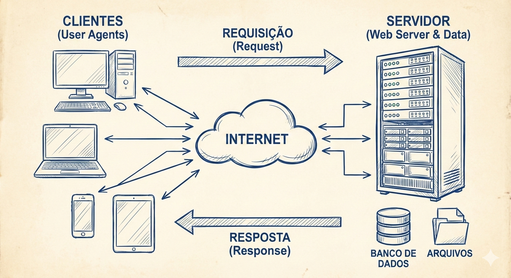
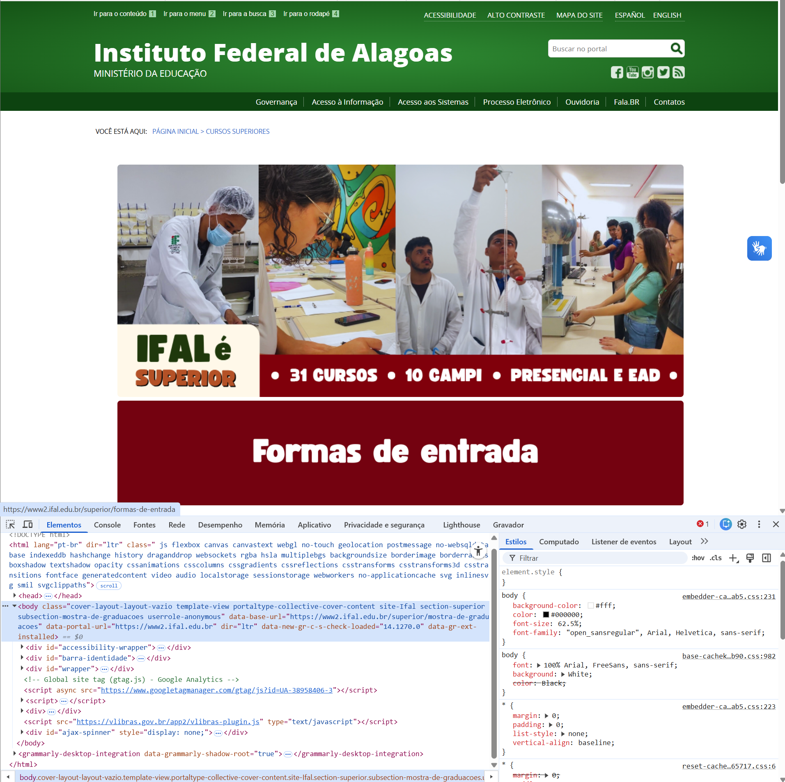

# Capítulo 1 — Introdução à Web e Ferramentas

---

## 1.1 — O que é a Web e como ela funciona

> **Vídeo:O que é e como funciona a internet**  
> <iframe width="100%" height="400"
    src="https://www.youtube-nocookie.com/embed/hBRDMaxKB8Q?rel=0&modestbranding=1"
    title="O que é e como funciona a internet"
    allow="accelerometer; autoplay; clipboard-write; encrypted-media; gyroscope; picture-in-picture; web-share"
    allowfullscreen
    loading="lazy">
</iframe>


A Web é uma das maiores invenções tecnológicas da história humana. Ela conecta pessoas, empresas, governos, dispositivos e sistemas em escala global. 
Para uma pessoa desenvolvedora, compreender **como a Web funciona por dentro** não é apenas útil — é essencial. 
Sem esse entendimento, o desenvolvimento se torna limitado, superficial e dependente de “receitas prontas”. 
Com esse entendimento, o desenvolvedor ganha autonomia, capacidade de diagnóstico, visão arquitetural e domínio técnico.

A **World Wide Web (WWW)**, frequentemente confundida no senso comum com a própria **Internet**, constitui, na realidade, um vasto sistema de informações globais que opera como uma camada de abstração de serviço *sobre* a infraestrutura física de redes. 
Enquanto a Internet refere-se estritamente à interconexão física global de computadores (hardware, cabos, roteadores) e aos protocolos de transporte de dados de baixo nível (como o **TCP/IP**), a Web é fundamentada em um conceito de **hipermídia** distribuída. 
Neste ecossistema digital, documentos e recursos — sejam eles textos, imagens ou aplicações — são identificados de forma única através de **URIs** (Uniform Resource Identifiers) e interconectados por meio de hiperlinks, criando uma "teia" complexa e não linear de informações navegáveis que transcendem as fronteiras geográficas dos servidores onde estão hospedados.

Do ponto de vista operacional, o funcionamento da Web baseia-se na **arquitetura cliente-servidor**, regida majoritariamente pelo protocolo de aplicação **HTTP** (Hypertext Transfer Protocol). 
O ciclo de vida de uma interação na Web inicia-se quando um "agente de usuário" (o cliente, tipicamente um navegador), submete uma **requisição** a um servidor remoto solicitando um recurso específico; este servidor processa o pedido e retorna uma **resposta** contendo o conteúdo solicitado — geralmente estruturado semanticamente em **HTML** e estilizado visualmente via **CSS**. 
O navegador, então, interpreta esses códigos recebidos para renderizar a interface gráfica final para o usuário, ocultando toda a complexidade da troca de dados subjacente.


### **Por que entender a arquitetura da Web é importante para uma pessoa desenvolvedora?**

A Web é construída sobre uma série de camadas, protocolos e padrões que trabalham juntos para permitir que páginas, aplicações e serviços funcionem. Quando você entende essa arquitetura:

- consegue **diagnosticar erros** (404, 500, DNS, CORS, cache, etc.);
- compreende **como otimizar desempenho** (cache, compressão, CDN);
- entende **como garantir segurança** (HTTPS, certificados, cookies, headers);
- desenvolve aplicações mais **robustas, escaláveis e acessíveis**;
- consegue dialogar com equipes de backend, infraestrutura e segurança.

Em outras palavras: **quem domina a arquitetura da Web domina o desenvolvimento moderno**.


> ### 📜 Breve Histórico da Web
> 
> 
> A gênese da World Wide Web remonta a março de **1989**, nas instalações do **CERN** (Organização Europeia para a Pesquisa Nuclear), próximo a Genebra. Foi neste cenário que o cientista da computação britânico **Sir Tim Berners-Lee** redigiu a proposta inicial para um sistema de gestão de informações baseado em hipertexto, visando resolver a dificuldade de compartilhamento de dados entre cientistas de diferentes universidades.
> Em **1990**, utilizando um computador NeXT, Berners-Lee desenvolveu as pedras angulares da Web: a linguagem HTML, o protocolo HTTP e o primeiro navegador (chamado *WorldWideWeb*). A materialização deste projeto ocorreu quando o **[primeiro website da história](http://info.cern.ch/hypertext/WWW/TheProject.html)** foi publicado, servindo como uma página explicativa sobre o próprio projeto. Em 1993, o CERN colocou o software da Web em domínio público, catalisando a explosão da Internet comercial.
> Quando criada, a web definia três tecnologias fundamentais:
> - **HTML (HyperText Markup Language)** — linguagem de marcação para documentos;  
> - **HTTP (HyperText Transfer Protocol)** — protocolo de comunicação;  
> - **URL (Uniform Resource Locator)** — identificador de recursos na Web.
> Essas três tecnologias continuam sendo a base da Web moderna.
>
> Com o tempo, novas tecnologias surgiram:
> - **CSS (1996)** — estilo e layout;  
> - **JavaScript (1995)** — interatividade;  
> - **AJAX (2005)** — páginas dinâmicas sem recarregar;  
> - **APIs REST (anos 2000)** — comunicação entre sistemas;  
> - **HTML5 (2014)** — multimídia, canvas, storage;  
> - **WebAssembly (2017)** — alto desempenho no navegador.
> 
> **Referência:** [CERN - The birth of the Web](https://home.cern/science/computing/birth-web)


### 1.1.1 — Cliente, Servidor e Navegador

A arquitetura da Web é fundamentada em um modelo de distribuição de tarefas conhecido como **Cliente-Servidor** (ver Figura Cliente-Servidor). 
Para compreender o funcionamento da rede em um nível de engenharia de software, é imperativo dissociar os papéis funcionais de cada componente, entendendo que a comunicação entre eles é estritamente protocolada.


#### O Cliente (Client)

No contexto técnico, o **cliente** é a entidade ativa que inicia a comunicação. Ele não se define pelo hardware (o computador ou smartphone), mas sim pelo software que submete uma requisição de serviço. Na terminologia do protocolo HTTP, o cliente é frequentemente referido como **User Agent** (Agente de Usuário). Sua função primária é formatar mensagens de solicitação (Requests) seguindo padrões definidos — especificando método, cabeçalhos e corpo — e enviá-las através da rede para um endereço específico. Embora o navegador seja o exemplo mais comum, scripts de automação (como *crawlers* ou *bots*), aplicações móveis e interfaces de linha de comando (como cURL) também atuam como clientes.

#### O Servidor (Server)

O termo **servidor** possui uma dualidade semântica na informática. Fisicamente, refere-se ao **hardware**: computadores de alto desempenho, otimizados para operar ininterruptamente (24/7), equipados com redundância de armazenamento (RAID) e conexão de banda larga de alta capacidade. Logicamente, e mais importante para o desenvolvimento web, refere-se ao **software servidor** (como Apache, Nginx ou IIS). Este software atua como um processo *daemon* (processo de segundo plano) que "escuta" (listening) portas específicas da rede — tradicionalmente a porta 80 para HTTP e 443 para HTTPS. Ao receber uma requisição do cliente, o software servidor processa a lógica necessária, acessa bancos de dados se preciso, e devolve o recurso ou uma mensagem de erro.

#### O Navegador (Browser)

O **navegador** é uma implementação específica de um cliente HTTP, projetado para interação humana. Sua complexidade técnica reside no **Motor de Renderização** (*Rendering Engine*), um componente de software responsável por receber o fluxo de dados brutos do servidor (texto HTML, regras CSS, scripts JS) e transformá-los em uma representação visual interativa. O navegador compila esses dados na memória do dispositivo construindo a **DOM** (Document Object Model), uma árvore estrutural de objetos que o usuário pode visualizar e manipular. Exemplos de motores de renderização incluem o *Blink* (usado no Chrome e Edge), *Gecko* (Firefox) e *WebKit* (Safari).


### 1.1.2 — Requisições e Respostas (HTTP)

O protocolo HTTP (Hypertext Transfer Protocol) é o alicerce da comunicação entre clientes e servidores na Web. Embora muitas vezes invisível ao usuário final, ele é o mecanismo que possibilita a transferência de documentos, imagens, scripts, dados estruturados e praticamente qualquer tipo de recurso digital. Para uma pessoa desenvolvedora, compreender o funcionamento do HTTP não é apenas desejável — é indispensável. Sem esse entendimento, torna‑se impossível diagnosticar problemas de rede, otimizar desempenho, implementar segurança ou construir APIs robustas.

HTTP é um protocolo **baseado em texto**, **sem estado** (stateless) e **orientado a requisições**. Isso significa que cada interação entre cliente e servidor é independente, e o servidor não mantém memória das requisições anteriores, a menos que mecanismos adicionais sejam utilizados (cookies, tokens, sessões, etc.). Essa característica, embora simples, é fundamental para a escalabilidade da Web moderna. Cada troca de dados é tratada como uma transação independente e isolada, composta invariavelmente por dois elementos estruturais: uma **Requisição** (Request) enviada pelo cliente e uma **Resposta** (Response) devolvida pelo servidor.


#### **A Estrutura de uma Requisição HTTP**

Quando o navegador precisa obter um recurso — seja uma página HTML, um arquivo CSS, um script JavaScript ou uma imagem — ele envia uma **requisição HTTP** ao servidor. Essa requisição é composta por três partes principais:


**1. Linha de requisição (Request Line)**  
Contém:

- **Método HTTP** (GET, POST, PUT, DELETE, etc.)  
- **Caminho do recurso**  
- **Versão do protocolo**

Exemplo:

```
GET /produtos HTTP/1.1
```

 **2. Cabeçalhos (Headers)**  
Os cabeçalhos fornecem metadados sobre a requisição, como:

- tipo de conteúdo aceito (`Accept`)  
- idioma preferido (`Accept-Language`)  
- informações do navegador (`User-Agent`)  
- cookies  
- autenticação  
- cache  

Exemplo:

```
Host: www.exemplo.com
User-Agent: Mozilla/5.0
Accept: text/html
```

 **3. Corpo da requisição (Body)**  
Nem toda requisição possui corpo.  
Métodos como **GET** não enviam corpo, enquanto **POST** e **PUT** frequentemente enviam dados (formulários, JSON, arquivos).

---

#### **A Estrutura de uma Resposta HTTP**

Após processar a requisição, o servidor devolve uma **resposta HTTP**, composta por:

**1. Linha de status (Status Line)**  
Inclui:

- versão do protocolo  
- código de status  
- mensagem textual

Exemplo:

```
HTTP/1.1 200 OK
```

**2. Cabeçalhos de resposta**  
Informam:

- tipo de conteúdo (`Content-Type`)  
- tamanho (`Content-Length`)  
- políticas de cache (`Cache-Control`)  
- cookies (`Set-Cookie`)  
- segurança (`Strict-Transport-Security`, `X-Frame-Options`)  

**3. Corpo da resposta**  
Contém o recurso solicitado: HTML, JSON, imagem, vídeo, etc.

---

#### **Códigos de Status HTTP**

Os códigos de status são fundamentais para diagnóstico e controle de fluxo. Eles são divididos em classes:

| Classe | Significado | Exemplos |
|--------|-------------|----------|
| **1xx** | Informacional | 100 Continue |
| **2xx** | Sucesso | 200 OK, 201 Created |
| **3xx** | Redirecionamento | 301 Moved Permanently, 302 Found |
| **4xx** | Erro do cliente | 400 Bad Request, 404 Not Found |
| **5xx** | Erro do servidor | 500 Internal Server Error, 503 Service Unavailable |

Para desenvolvedores, compreender essas classes é essencial para depuração (localizar e corrigir erros ou bugs no software) e para a construção de APIs.

---

#### **HTTP como Protocolo Stateless**

A característica *stateless* significa que cada requisição é independente.  
Isso traz vantagens:

- escalabilidade;  
- simplicidade;  
- paralelismo.  

Mas também traz desafios:

- autenticação precisa ser reenviada;  
- estado da aplicação deve ser mantido no cliente ou em mecanismos externos;  
- sessões precisam de _cookies_ ou _tokens_.  

Essa limitação levou ao surgimento de tecnologias como:

- **JWT (JSON Web Tokens)**  
- **Cookies de sessão**  
- **LocalStorage / SessionStorage**  
- **APIs RESTful com autenticação stateless**

---


> #### 📜 **Evolução do HTTP**
> 
> 
> O HTTP passou por várias versões:
>
> **HTTP/1.1 (1997)**  
> - Conexões persistentes  
> - Cabeçalhos mais ricos  
> - Amplamente utilizado até hoje  
> 
> **HTTP/2 (2015)**  
> - Multiplexação  
> - Compressão de cabeçalhos  
> - Server Push  
> - Melhor desempenho  
> 
> **HTTP/3 (2022)**  
> - Baseado em QUIC (UDP)  
> - Redução de latência  
> - Melhor performance em redes instáveis  
> 
> A Web moderna está migrando gradualmente para HTTP/3, especialmente em serviços de grande escala (Google, Cloudflare, Meta).


---

### 1.1.3 — Endereçamento e Infraestrutura

Para que o ciclo de Requisição e Resposta (HTTP) ocorra com êxito, é necessário transpor uma barreira fundamental de comunicação: a localização exata do servidor na vasta topologia da rede global. 
A infraestrutura da Internet opera sobre um sistema numérico rigoroso, invisível ao usuário comum, mas essencial para o roteamento de dados: o **Endereço IP** (Internet Protocol).

Cada dispositivo conectado à rede, seja ele um servidor de alto desempenho ou um smartphone, recebe um identificador numérico único, análogo a uma coordenada geográfica ou um número telefônico. 
Atualmente, coexistem dois padrões principais: o **IPv4** (composto por quatro octetos, ex: `192.168.1.1`) e o **IPv6** (uma sequência hexadecimal mais longa, desenvolvida para suprir a escassez de endereços do padrão anterior). 
É através destes endereços que os roteadores e *switches* sabem exatamente para onde direcionar os pacotes de dados.

No entanto, a memorização de sequências numéricas complexas é inviável para a cognição humana. Para solucionar este problema de usabilidade, foi implementada uma camada de abstração hierárquica e distribuída denominada **DNS (Domain Name System)**. 
O DNS atua como uma lista telefônica dinâmica e descentralizada da Internet.

Quando um usuário digita um domínio mnemônico (como `www.exemplo.com.br`) na barra de endereços, o navegador inicia um processo denominado **Resolução de Nomes**. O sistema consulta servidores DNS recursivos e autoritativos em uma cadeia hierárquica até encontrar o Endereço IP correspondente àquele domínio. Somente após obter essa "tradução" do nome para o número IP é que o navegador consegue estabelecer a conexão TCP/IP real com o servidor e enviar a requisição HTTP. Todo esse processo complexo ocorre em milissegundos, tornando a experiência de navegação fluida e transparente.

---

<div class="box-destaque">
    <h3 class="box-titulo">O que acontece quando você digita uma URL no navegador?</h3>
    <p> 
        Imagine que o usuário digita:
        
        ```
        https://www.exemplo.com/produtos
        ```
        
        O navegador inicia uma sequência complexa de operações. Vamos detalhar cada etapa.        
          <ol>
            
            <li>
              <h3>Verificação do Cache Local</h3>
              <p>Antes de ir à web, o navegador tenta economizar tempo e banda verificando se já possui uma cópia recente do recurso solicitado.</p>
              <p>Ele consulta cabeçalhos como:</p>
              <ul>
                <li><strong>Cache-Control</strong></li>
                <li><strong>Expires</strong></li>
                <li><strong>ETag</strong></li>
              </ul>
              <blockquote>
                Se o navegador encontrar uma versão válida no cache, ele <strong>não precisa acessar o servidor</strong>. Se <strong>não</strong> encontrar, ele segue para a próxima etapa.
              </blockquote>
            </li>
        
            <hr>
        
            <li>
              <h3>Resolução de nomes (DNS)</h3>
              <p>O navegador precisa transformar o nome do domínio:</p>
              <pre><code>www.exemplo.com</code></pre>
              <p>Em um endereço IP, como:</p>
              <ul>
                <li>IPv4 → <code>192.0.2.1</code></li>
                <li>IPv6 → <code>2001:db8::1</code></li>
              </ul>
              <p>Essa conversão é feita pelo <strong>DNS (Domain Name System)</strong>.</p>
              
              <div class="sub-secao">
                <h4>Como funciona o DNS?</h4>
                <ol>
                  <li>O navegador pergunta ao SO: <em>“Você sabe o IP de www.exemplo.com?”</em></li>
                  <li>Se o sistema não souber, consulta o <strong>servidor DNS configurado</strong> (provedor, Google, etc).</li>
                  <li>O servidor DNS segue a cadeia hierárquica (Root → TLD → Authoritative).</li>
                  <li>O servidor autoritativo responde com o IP correto.</li>
                  <li>O navegador armazena a resposta (TTL).</li>
                </ol>
              </div>
        
              <div class="sub-secao">
                <h4>DNS usa UDP ou TCP?</h4>
                <ul>
                  <li>Normalmente <strong>UDP porta 53</strong> (rápido e leve).</li>
                  <li>Em casos específicos, <strong>TCP</strong> (respostas grandes, DNSSEC).</li>
                </ul>
              </div>
            </li>
        
            <hr>
        
            <li>
              <h3>Protocolo IP e suas versões</h3>
              <p>O endereço IP identifica dispositivos na rede.</p>
              
              <h4>IPv4</h4>
              <ul>
                <li>32 bits</li>
                <li>~4 bilhões de endereços</li>
                <li>Exemplo: <code>192.168.0.1</code></li>
              </ul>
        
              <h4>IPv6</h4>
              <ul>
                <li>128 bits</li>
                <li>Quantidade praticamente infinita</li>
                <li>Exemplo: <code>2001:0db8:85a3::8a2e...</code></li>
              </ul>
              <p>A Web moderna funciona com ambos, mas o IPv6 está crescendo rapidamente.</p>
            </li>
        
            <hr>
        
            <li>
              <h3>Estrutura da URL</h3>
              <p>Uma URL possui três partes principais:</p>
              <pre><code>https://www.exemplo.com/produtos</code></pre>
        
              <ul>
                <li><strong>1. Protocolo:</strong> Define a comunicação (`http://` ou `https://`).</li>
                <li><strong>2. Domínio:</strong> Nome registrado que aponta para um servidor (`www.exemplo.com`).</li>
                <li><strong>3. Caminho:</strong> Indica o recurso solicitado (`/produtos`).</li>
              </ul>
            </li>
        
            <hr>
        
            <li>
              <h3>Cliente envia requisição ao servidor</h3>
              <p>Com o IP em mãos, o navegador abre uma conexão (TCP ou QUIC) e envia a requisição:</p>
              <pre><code>GET /produtos HTTP/1.1
        Host: www.exemplo.com</code></pre>
            </li>
        
            <hr>
        
            <li>
              <h3>Servidor responde</h3>
              <p>O servidor processa a requisição e devolve:</p>
              <ul>
                <li>Código de status (200, 404, 500…)</li>
                <li>Cabeçalhos</li>
                <li>Corpo da resposta (HTML, JSON, imagem, etc.)</li>
              </ul>
            </li>
        
            <hr>
        
            <li>
              <h3>Navegador renderiza a página</h3>
              <p>O processo final de renderização:</p>
              <ol>
                <li>Lê o HTML.</li>
                <li>Baixa recursos externos (CSS, JS, Imagens).</li>
                <li>Monta a árvore DOM.</li>
                <li>Aplica estilos e executa scripts.</li>
                <li>Exibe a página ao usuário.</li>
              </ol>
            </li>
        
          </ol>
        
    </p>
</div>


#### **Atividade de Revisão — Seção 1.1**

<div class="quiz" data-answer="b">
  <p><strong>1.</strong> Qual é a diferença fundamental entre a Internet e a World Wide Web (WWW)?</p>

  <button data-option="a">Não há diferença, são sinônimos exatos.</button>
  <button data-option="b">A Internet é a infraestrutura física de conexão; a Web é o sistema de informações que roda sobre ela.</button>
  <button data-option="c">A Web refere-se aos cabos submarinos, enquanto a Internet são os sites.</button>
  <button data-option="d">A Internet utiliza o protocolo HTTP, enquanto a Web utiliza apenas TCP/IP.</button>

  <p class="feedback"></p>
</div>

<div class="quiz" data-answer="c">
  <p><strong>2.</strong> No contexto de uma requisição HTTP, o que indica um Código de Status da classe 4xx (como o 404)?</p>

  <button data-option="a">Sucesso na operação.</button>
  <button data-option="b">Erro interno do servidor.</button>
  <button data-option="c">Erro originado no cliente (ex: página não encontrada).</button>
  <button data-option="d">Redirecionamento para outra URL.</button>

  <p class="feedback"></p>
</div>

<div class="quiz" data-answer="a">
  <p><strong>3.</strong> Antes de enviar uma requisição HTTP, o navegador precisa traduzir o nome do domínio (ex: www.site.com) em um endereço IP. Qual sistema é responsável por isso?</p>

  <button data-option="a">DNS (Domain Name System)</button>
  <button data-option="b">DOM (Document Object Model)</button>
  <button data-option="c">CSSOM (CSS Object Model)</button>
  <button data-option="d">TLS (Transport Layer Security)</button>

  <p class="feedback"></p>
</div>

---


### 1.2 — Ferramentas Essenciais para Desenvolvimento Web

O desenvolvimento Web moderno exige mais do que apenas conhecer linguagens como HTML, CSS e JavaScript. Ele demanda um conjunto de ferramentas que ampliam a produtividade, facilitam o diagnóstico de problemas, automatizam tarefas e permitem versionar e compartilhar código de forma profissional. Nesta seção, exploraremos as ferramentas fundamentais que todo desenvolvedor Web deve dominar desde o início da sua formação.

---

#### 1.2.1 — Navegadores e DevTools

Os navegadores modernos — como **Google Chrome**, **Mozilla Firefox**, **Microsoft Edge** e **Safari** — são muito mais do que simples programas para acessar páginas. Eles são verdadeiros **ambientes de execução** para aplicações Web, contendo motores de renderização, interpretadores JavaScript, mecanismos de segurança e ferramentas avançadas de inspeção.

**Motores de Renderização**
Cada navegador utiliza um motor responsável por interpretar HTML, CSS e JavaScript:

- **Blink** (Chrome, Edge, Opera)  
- **Gecko** (Firefox)  
- **WebKit** (Safari)

Esses motores convertem código em interfaces visuais, manipulam o DOM ([Document Object Model](https://developer.mozilla.org/pt-BR/docs/Web/API/Document_Object_Model)), aplicam estilos e executam scripts. Entender como eles funcionam ajuda a diagnosticar problemas de compatibilidade e desempenho.

**DevTools: o laboratório do desenvolvedor**
> **Vídeo: O que é DevTools e como ele pode te ajudar**  
> <iframe width="100%" height="400"
    src="https://www.youtube-nocookie.com/embed/miBh6WRuEy8?rel=0&modestbranding=1"
    title="O que é DevTools e como ele pode te ajudar"
    allow="accelerometer; autoplay; clipboard-write; encrypted-media; gyroscope; picture-in-picture; web-share"
    allowfullscreen
    loading="lazy">
</iframe>

As **Ferramentas de Desenvolvedor (DevTools)** são um conjunto de utilitários integrados ao navegador que permitem:

- Inspecionar e editar o DOM em tempo real  
- Visualizar e modificar CSS dinamicamente  
- Monitorar requisições HTTP  
- Analisar desempenho (Performance)  
- Depurar JavaScript (Debugging)  
- Verificar acessibilidade  
- Simular dispositivos móveis  
- Monitorar armazenamento local (LocalStorage, Cookies, IndexedDB)

O DevTools é indispensável para qualquer desenvolvedor Web. Ele transforma o navegador em um ambiente de experimentação e diagnóstico, permitindo compreender o comportamento da aplicação em detalhes.

> Para abrir o DevTools (Ferramentas do Desenvolvedor) no Chrome ou Firefox, utilize os atalhos universais F12 ou Ctrl+Shift+I (Windows/Linux) e Cmd+Opt+I (Mac). Alternativamente, clique com o botão direito em qualquer página e selecione "Inspecionar" ou acesse o menu de três pontos > "Mais Ferramentas" > "Ferramentas do desenvolvedor
>
> 
> 

---

#### 1.2.2 — Editor de Texto - Opção Atual: VS Code
> **Vídeo: Como usar o VS CODE para programar? **  
> <iframe width="100%" height="400"
    src="https://www.youtube-nocookie.com/embed/pkH6XxH57O8?rel=0&modestbranding=1"
    title="Como usar o VS CODE para programar?"
    allow="accelerometer; autoplay; clipboard-write; encrypted-media; gyroscope; picture-in-picture; web-share"
    allowfullscreen
    loading="lazy">
</iframe>

O **Visual Studio Code (VS Code)** é hoje o editor de código mais utilizado no mundo. Ele combina leveza, extensibilidade e uma interface moderna, tornando-se ideal tanto para iniciantes quanto para profissionais.

**Por que o VS Code é tão popular?**

- Suporte nativo a HTML, CSS e JavaScript  
- Terminal integrado  
- Git integrado  
- Depurador embutido  
- Extensões para praticamente qualquer tecnologia  
- Autocompletar inteligente (IntelliSense)  
- Suporte a snippets e formatação automática  

---

#### 1.2.3 — Git e GitHub (visão inicial)
> **Vídeo: O QUE É GIT E GITHUB? - definição e conceitos importantes**  
> <iframe width="100%" height="400"
    src="https://www.youtube-nocookie.com/embed/DqTITcMq68k?rel=0&modestbranding=1"
    title="O QUE É GIT E GITHUB? - definição e conceitos importantes"
    allow="accelerometer; autoplay; clipboard-write; encrypted-media; gyroscope; picture-in-picture; web-share"
    allowfullscreen
    loading="lazy">
</iframe>

> **Vídeo: COMO USAR GIT E GITHUB NA PRÁTICA! - desde o primeiro commit até o pull request!**  
> <iframe width="100%" height="400"
    src="https://www.youtube-nocookie.com/embed/UBAX-13g8OM?rel=0&modestbranding=1"
    title="COMO USAR GIT E GITHUB NA PRÁTICA! - desde o primeiro commit até o pull request!"
    allow="accelerometer; autoplay; clipboard-write; encrypted-media; gyroscope; picture-in-picture; web-share"
    allowfullscreen
    loading="lazy">
</iframe>

O **Git** é um sistema de controle de versão distribuído. Ele permite que desenvolvedores acompanhem mudanças no código, revertam erros, criem ramificações (branches) e colaborem em projetos de forma segura e eficiente.

**Por que aprender Git desde o início?**

- Evita perda de código  
- Permite trabalhar em equipe  
- Facilita a organização de projetos  
- É exigido em praticamente todas as vagas de TI  
- É a base do GitHub Classroom, usado na disciplina

**GitHub: a plataforma social do código**

O **GitHub** é um serviço baseado em Git que permite:

- Hospedar repositórios  
- Criar issues  
- Fazer pull requests  
- Criar wikis  
- Automatizar tarefas com GitHub Actions  
- Trabalhar em equipe  
- Criar portfólio profissional

---

#### 1.2.4 — Ambientes online (CodePen, JSFiddle)

> **Vídeo: Por dentro da ferramenta de programação CodePen**  
> <iframe width="100%" height="400"
    src="https://www.youtube-nocookie.com/embed/l9vPtKzKkSc?rel=0&modestbranding=1"
    title="Por dentro da ferramenta de programação CodePen"
    allow="accelerometer; autoplay; clipboard-write; encrypted-media; gyroscope; picture-in-picture; web-share"
    allowfullscreen
    loading="lazy">
</iframe>

Ambientes online como **CodePen**, **JSFiddle**, **JSBin** e **StackBlitz** permitem testar código HTML, CSS e JavaScript diretamente no navegador, sem necessidade de instalar nada.

**Por que usar esses ambientes?**

- Ideal para experimentação rápida  
- Perfeito para iniciantes  
- Facilita o compartilhamento de exemplos  
- Permite testar ideias sem criar arquivos locais  
- Útil para depurar pequenos trechos de código  

---
 
##### **Atividades — Seção 1.2**

- **Quiz:** Ferramentas e DevTools *(link será adicionado)*  
- **GitHub Classroom:** Criar repositório inicial e enviar `hello.html` *(link será adicionado)*  


